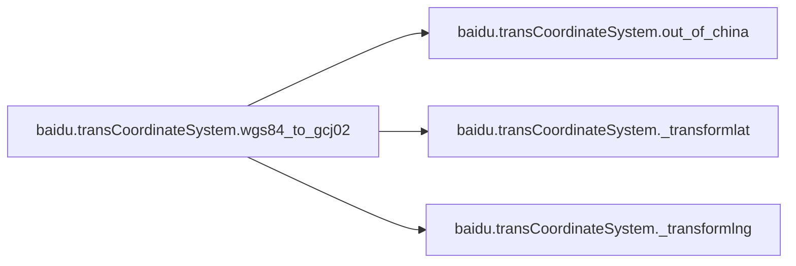
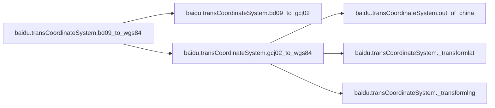
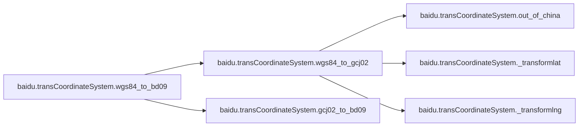

# Baidu Transcoordinatesystem

[_Documentation generated by Documatic_](https://www.documatic.com)

<!---Documatic-section-Codebase Structure-start--->
## Codebase Structure

<!---Documatic-block-system_architecture-start--->
```mermaid
None
```
<!---Documatic-block-system_architecture-end--->

# #
<!---Documatic-section-Codebase Structure-end--->

<!---Documatic-section-baidu.transCoordinateSystem.gcj02_to_bd09-start--->
## baidu.transCoordinateSystem.gcj02_to_bd09

<!---Documatic-section-gcj02_to_bd09-start--->
<!---Documatic-block-baidu.transCoordinateSystem.gcj02_to_bd09-start--->
<details>
	<summary><code>baidu.transCoordinateSystem.gcj02_to_bd09</code> code snippet</summary>

```python
def gcj02_to_bd09(lng, lat):
    z = math.sqrt(lng * lng + lat * lat) + 2e-05 * math.sin(lat * x_pi)
    theta = math.atan2(lat, lng) + 3e-06 * math.cos(lng * x_pi)
    bd_lng = z * math.cos(theta) + 0.0065
    bd_lat = z * math.sin(theta) + 0.006
    return [bd_lng, bd_lat]
```
</details>
<!---Documatic-block-baidu.transCoordinateSystem.gcj02_to_bd09-end--->
<!---Documatic-section-gcj02_to_bd09-end--->

# #
<!---Documatic-section-baidu.transCoordinateSystem.gcj02_to_bd09-end--->

<!---Documatic-section-baidu.transCoordinateSystem.bd09_to_gcj02-start--->
## baidu.transCoordinateSystem.bd09_to_gcj02

<!---Documatic-section-bd09_to_gcj02-start--->
<!---Documatic-block-baidu.transCoordinateSystem.bd09_to_gcj02-start--->
<details>
	<summary><code>baidu.transCoordinateSystem.bd09_to_gcj02</code> code snippet</summary>

```python
def bd09_to_gcj02(bd_lon, bd_lat):
    x = bd_lon - 0.0065
    y = bd_lat - 0.006
    z = math.sqrt(x * x + y * y) - 2e-05 * math.sin(y * x_pi)
    theta = math.atan2(y, x) - 3e-06 * math.cos(x * x_pi)
    gg_lng = z * math.cos(theta)
    gg_lat = z * math.sin(theta)
    return [gg_lng, gg_lat]
```
</details>
<!---Documatic-block-baidu.transCoordinateSystem.bd09_to_gcj02-end--->
<!---Documatic-section-bd09_to_gcj02-end--->

# #
<!---Documatic-section-baidu.transCoordinateSystem.bd09_to_gcj02-end--->

<!---Documatic-section-baidu.transCoordinateSystem.wgs84_to_gcj02-start--->
## baidu.transCoordinateSystem.wgs84_to_gcj02

<!---Documatic-section-wgs84_to_gcj02-start--->


### Object Calls

* baidu.transCoordinateSystem.out_of_china
* baidu.transCoordinateSystem._transformlat
* baidu.transCoordinateSystem._transformlng

<!---Documatic-block-baidu.transCoordinateSystem.wgs84_to_gcj02-start--->
<details>
	<summary><code>baidu.transCoordinateSystem.wgs84_to_gcj02</code> code snippet</summary>

```python
def wgs84_to_gcj02(lng, lat):
    if out_of_china(lng, lat):
        return (lng, lat)
    dlat = _transformlat(lng - 105.0, lat - 35.0)
    dlng = _transformlng(lng - 105.0, lat - 35.0)
    radlat = lat / 180.0 * pi
    magic = math.sin(radlat)
    magic = 1 - ee * magic * magic
    sqrtmagic = math.sqrt(magic)
    dlat = dlat * 180.0 / (a * (1 - ee) / (magic * sqrtmagic) * pi)
    dlng = dlng * 180.0 / (a / sqrtmagic * math.cos(radlat) * pi)
    mglat = lat + dlat
    mglng = lng + dlng
    return [mglng, mglat]
```
</details>
<!---Documatic-block-baidu.transCoordinateSystem.wgs84_to_gcj02-end--->
<!---Documatic-section-wgs84_to_gcj02-end--->

# #
<!---Documatic-section-baidu.transCoordinateSystem.wgs84_to_gcj02-end--->

<!---Documatic-section-baidu.transCoordinateSystem.gcj02_to_wgs84-start--->
## baidu.transCoordinateSystem.gcj02_to_wgs84

<!---Documatic-section-gcj02_to_wgs84-start--->


### Object Calls

* baidu.transCoordinateSystem.out_of_china
* baidu.transCoordinateSystem._transformlat
* baidu.transCoordinateSystem._transformlng

<!---Documatic-block-baidu.transCoordinateSystem.gcj02_to_wgs84-start--->
<details>
	<summary><code>baidu.transCoordinateSystem.gcj02_to_wgs84</code> code snippet</summary>

```python
def gcj02_to_wgs84(lng, lat):
    if out_of_china(lng, lat):
        return (lng, lat)
    dlat = _transformlat(lng - 105.0, lat - 35.0)
    dlng = _transformlng(lng - 105.0, lat - 35.0)
    radlat = lat / 180.0 * pi
    magic = math.sin(radlat)
    magic = 1 - ee * magic * magic
    sqrtmagic = math.sqrt(magic)
    dlat = dlat * 180.0 / (a * (1 - ee) / (magic * sqrtmagic) * pi)
    dlng = dlng * 180.0 / (a / sqrtmagic * math.cos(radlat) * pi)
    mglat = lat + dlat
    mglng = lng + dlng
    return [lng * 2 - mglng, lat * 2 - mglat]
```
</details>
<!---Documatic-block-baidu.transCoordinateSystem.gcj02_to_wgs84-end--->
<!---Documatic-section-gcj02_to_wgs84-end--->

# #
<!---Documatic-section-baidu.transCoordinateSystem.gcj02_to_wgs84-end--->

<!---Documatic-section-baidu.transCoordinateSystem.bd09_to_wgs84-start--->
## baidu.transCoordinateSystem.bd09_to_wgs84

<!---Documatic-section-bd09_to_wgs84-start--->


### Object Calls

* baidu.transCoordinateSystem.bd09_to_gcj02
* baidu.transCoordinateSystem.gcj02_to_wgs84

<!---Documatic-block-baidu.transCoordinateSystem.bd09_to_wgs84-start--->
<details>
	<summary><code>baidu.transCoordinateSystem.bd09_to_wgs84</code> code snippet</summary>

```python
def bd09_to_wgs84(bd_lon, bd_lat):
    (lon, lat) = bd09_to_gcj02(bd_lon, bd_lat)
    return gcj02_to_wgs84(lon, lat)
```
</details>
<!---Documatic-block-baidu.transCoordinateSystem.bd09_to_wgs84-end--->
<!---Documatic-section-bd09_to_wgs84-end--->

# #
<!---Documatic-section-baidu.transCoordinateSystem.bd09_to_wgs84-end--->

<!---Documatic-section-baidu.transCoordinateSystem.wgs84_to_bd09-start--->
## baidu.transCoordinateSystem.wgs84_to_bd09

<!---Documatic-section-wgs84_to_bd09-start--->


### Object Calls

* baidu.transCoordinateSystem.wgs84_to_gcj02
* baidu.transCoordinateSystem.gcj02_to_bd09

<!---Documatic-block-baidu.transCoordinateSystem.wgs84_to_bd09-start--->
<details>
	<summary><code>baidu.transCoordinateSystem.wgs84_to_bd09</code> code snippet</summary>

```python
def wgs84_to_bd09(lon, lat):
    (lon, lat) = wgs84_to_gcj02(lon, lat)
    return gcj02_to_bd09(lon, lat)
```
</details>
<!---Documatic-block-baidu.transCoordinateSystem.wgs84_to_bd09-end--->
<!---Documatic-section-wgs84_to_bd09-end--->

# #
<!---Documatic-section-baidu.transCoordinateSystem.wgs84_to_bd09-end--->

<!---Documatic-section-baidu.transCoordinateSystem._transformlat-start--->
## baidu.transCoordinateSystem._transformlat

<!---Documatic-section-_transformlat-start--->
<!---Documatic-block-baidu.transCoordinateSystem._transformlat-start--->
<details>
	<summary><code>baidu.transCoordinateSystem._transformlat</code> code snippet</summary>

```python
def _transformlat(lng, lat):
    ret = -100.0 + 2.0 * lng + 3.0 * lat + 0.2 * lat * lat + 0.1 * lng * lat + 0.2 * math.sqrt(math.fabs(lng))
    ret += (20.0 * math.sin(6.0 * lng * pi) + 20.0 * math.sin(2.0 * lng * pi)) * 2.0 / 3.0
    ret += (20.0 * math.sin(lat * pi) + 40.0 * math.sin(lat / 3.0 * pi)) * 2.0 / 3.0
    ret += (160.0 * math.sin(lat / 12.0 * pi) + 320 * math.sin(lat * pi / 30.0)) * 2.0 / 3.0
    return ret
```
</details>
<!---Documatic-block-baidu.transCoordinateSystem._transformlat-end--->
<!---Documatic-section-_transformlat-end--->

# #
<!---Documatic-section-baidu.transCoordinateSystem._transformlat-end--->

<!---Documatic-section-baidu.transCoordinateSystem._transformlng-start--->
## baidu.transCoordinateSystem._transformlng

<!---Documatic-section-_transformlng-start--->
<!---Documatic-block-baidu.transCoordinateSystem._transformlng-start--->
<details>
	<summary><code>baidu.transCoordinateSystem._transformlng</code> code snippet</summary>

```python
def _transformlng(lng, lat):
    ret = 300.0 + lng + 2.0 * lat + 0.1 * lng * lng + 0.1 * lng * lat + 0.1 * math.sqrt(math.fabs(lng))
    ret += (20.0 * math.sin(6.0 * lng * pi) + 20.0 * math.sin(2.0 * lng * pi)) * 2.0 / 3.0
    ret += (20.0 * math.sin(lng * pi) + 40.0 * math.sin(lng / 3.0 * pi)) * 2.0 / 3.0
    ret += (150.0 * math.sin(lng / 12.0 * pi) + 300.0 * math.sin(lng / 30.0 * pi)) * 2.0 / 3.0
    return ret
```
</details>
<!---Documatic-block-baidu.transCoordinateSystem._transformlng-end--->
<!---Documatic-section-_transformlng-end--->

# #
<!---Documatic-section-baidu.transCoordinateSystem._transformlng-end--->

<!---Documatic-section-baidu.transCoordinateSystem.out_of_china-start--->
## baidu.transCoordinateSystem.out_of_china

<!---Documatic-section-out_of_china-start--->
<!---Documatic-block-baidu.transCoordinateSystem.out_of_china-start--->
<details>
	<summary><code>baidu.transCoordinateSystem.out_of_china</code> code snippet</summary>

```python
def out_of_china(lng, lat):
    return not (lng > 73.66 and lng < 135.05 and (lat > 3.86) and (lat < 53.55))
```
</details>
<!---Documatic-block-baidu.transCoordinateSystem.out_of_china-end--->
<!---Documatic-section-out_of_china-end--->

# #
<!---Documatic-section-baidu.transCoordinateSystem.out_of_china-end--->

[_Documentation generated by Documatic_](https://www.documatic.com)