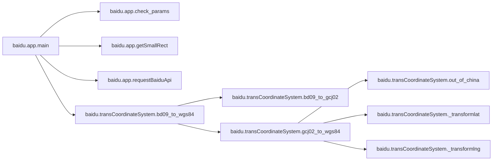

# Baidu App

[_Documentation generated by Documatic_](https://www.documatic.com)

<!---Documatic-section-Codebase Structure-start--->
## Codebase Structure

<!---Documatic-block-system_architecture-start--->

<!---Documatic-block-system_architecture-end--->

# #
<!---Documatic-section-Codebase Structure-end--->

<!---Documatic-section-baidu.app.getSmallRect-start--->
## [baidu.app.getSmallRect](4-baidu_app.md#baidu.app.getSmallRect)

<!---Documatic-section-getSmallRect-start--->
<!---Documatic-block-baidu.app.getSmallRect-start--->
<details>
	<summary><code>baidu.app.getSmallRect</code> code snippet</summary>

```python
def getSmallRect(bigRect, windowSize, windowIndex):
    offset_x = (bigRect['right']['x'] - bigRect['left']['x']) / windowSize['xNum']
    offset_y = (bigRect['right']['y'] - bigRect['left']['y']) / windowSize['yNum']
    left_x = bigRect['left']['x'] + offset_x * (windowIndex % windowSize['xNum'])
    left_y = bigRect['left']['y'] + offset_y * (windowIndex // windowSize['yNum'])
    right_x = left_x + offset_x
    right_y = left_y + offset_y
    return str(left_y) + ',' + str(left_x) + ',' + str(right_y) + ',' + str(right_x)
```
</details>
<!---Documatic-block-baidu.app.getSmallRect-end--->
<!---Documatic-section-getSmallRect-end--->

# #
<!---Documatic-section-baidu.app.getSmallRect-end--->

<!---Documatic-section-baidu.app.requestBaiduApi-start--->
## [baidu.app.requestBaiduApi](4-baidu_app.md#baidu.app.requestBaiduApi)

<!---Documatic-section-requestBaiduApi-start--->
<!---Documatic-block-baidu.app.requestBaiduApi-start--->
<details>
	<summary><code>baidu.app.requestBaiduApi</code> code snippet</summary>

```python
def requestBaiduApi(keyWords, smallRect, baiduAk):
    pageNum = 0
    file = open(os.getcwd() + os.sep + 'data/result.txt', 'a+', encoding='utf-8')
    pois = []
    while True:
        try:
            URL = 'http://api.map.baidu.com/place/v2/search?query=' + keyWords + '&bounds=' + smallRect + '&output=json' + '&ak=' + baiduAk + '&scope=2' + '&page_size=20' + '&page_num=' + str(pageNum)
            print(URL)
            resp = requests.get(URL)
            res = json.loads(resp.text)
            if len(res['results']) == 0:
                print('返回结果为0')
                break
            else:
                for r in res['results']:
                    pois.append(r)
                    file.writelines(str(r).strip() + '\n')
            pageNum += 1
            time.sleep(1)
        except Exception as e:
            print('爬取失败，请查看输出的错误信息：', resp.text.strip())
            break
    return pois
```
</details>
<!---Documatic-block-baidu.app.requestBaiduApi-end--->
<!---Documatic-section-requestBaiduApi-end--->

# #
<!---Documatic-section-baidu.app.requestBaiduApi-end--->

<!---Documatic-section-baidu.app.check_params-start--->
## [baidu.app.check_params](4-baidu_app.md#baidu.app.check_params)

<!---Documatic-section-check_params-start--->
<!---Documatic-block-baidu.app.check_params-start--->
<details>
	<summary><code>baidu.app.check_params</code> code snippet</summary>

```python
def check_params():
    min_lng = BigRect['left']['x']
    max_lng = BigRect['right']['x']
    min_lat = BigRect['left']['y']
    max_lat = BigRect['right']['y']
    if int(min_lng) > int(max_lng):
        print('输入经度有误!，右上角的经度应该大于左下角的经度值')
        exit(0)
    if int(min_lat) > int(max_lat):
        print('输入经度有误!，右上角的纬度应该大于左下角的纬度值')
        exit(0)
```
</details>
<!---Documatic-block-baidu.app.check_params-end--->
<!---Documatic-section-check_params-end--->

# #
<!---Documatic-section-baidu.app.check_params-end--->

<!---Documatic-section-baidu.app.main-start--->
## [baidu.app.main](4-baidu_app.md#baidu.app.main)

<!---Documatic-section-main-start--->


### Object Calls

* [baidu.app.check_params](4-baidu_app.md#baidu.app.check_params)
* [baidu.app.getSmallRect](4-baidu_app.md#baidu.app.getSmallRect)
* [baidu.app.requestBaiduApi](4-baidu_app.md#baidu.app.requestBaiduApi)
* baidu.transCoordinateSystem.bd09_to_wgs84

<!---Documatic-block-baidu.app.main-start--->
<details>
	<summary><code>baidu.app.main</code> code snippet</summary>

```python
def main():
    check_params()
    all_pois = []
    for index in range(int(WindowSize['xNum'] * WindowSize['yNum'])):
        smallRect = getSmallRect(BigRect, WindowSize, index)
        print(smallRect)
        pois = requestBaiduApi(keyWords=KeyWord, smallRect=smallRect, baiduAk=baiduAk)
        all_pois.extend(pois)
        time.sleep(1)
    data_csv = {}
    (uids, names, provinces, citys, areas, addresses, lngs, lats) = ([], [], [], [], [], [], [], [])
    for poi in all_pois:
        if poi == None:
            continue
        uids.append(poi.get('uid'))
        names.append(poi.get('name'))
        provinces.append(poi.get('province'))
        citys.append(poi.get('city'))
        areas.append(poi.get('area'))
        addresses.append(poi.get('address'))
        location = poi['location']
        lng = location['lng']
        lat = location['lat']
        result = bd09_to_wgs84(float(lng), float(lat))
        lng = result[0]
        lat = result[1]
        lngs.append(lng)
        lats.append(lat)
    data_csv['uid'] = uids
    data_csv['name'] = names
    data_csv['province'] = provinces
    data_csv['city'] = citys
    data_csv['area'] = areas
    data_csv['address'] = addresses
    data_csv['lng'] = lngs
    data_csv['lat'] = lats
    df = pd.DataFrame(data_csv)
    data_path = os.getcwd() + os.sep + 'data' + os.sep
    if not os.path.exists(data_path):
        os.mkdir(data_path)
    df.to_csv(data_path + 'bmap-poi-' + KeyWord + '.csv', index=False, encoding='utf_8_sig')
```
</details>
<!---Documatic-block-baidu.app.main-end--->
<!---Documatic-section-main-end--->

# #
<!---Documatic-section-baidu.app.main-end--->

[_Documentation generated by Documatic_](https://www.documatic.com)