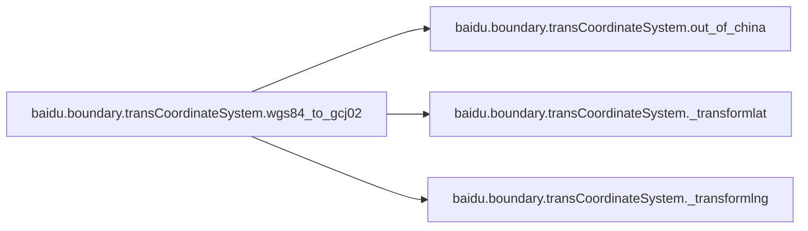
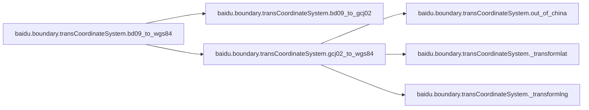
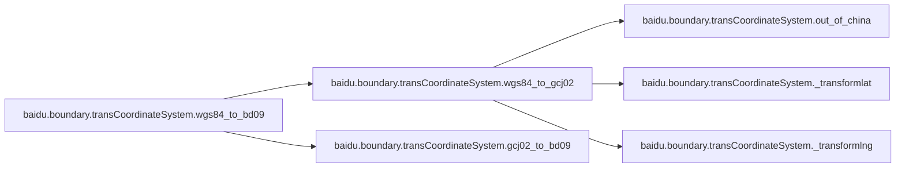

# Baidu Boundary

[_Documentation generated by Documatic_](https://www.documatic.com)

<!---Documatic-section-Codebase Structure-start--->
## Codebase Structure

<!---Documatic-block-system_architecture-start--->

<!---Documatic-block-system_architecture-end--->

# #
<!---Documatic-section-Codebase Structure-end--->

<!---Documatic-section-baidu.boundary.transCoordinateSystem.gcj02_to_bd09-start--->
## [baidu.boundary.transCoordinateSystem.gcj02_to_bd09](5-baidu_boundary.md#baidu.boundary.transCoordinateSystem.gcj02_to_bd09)

<!---Documatic-section-gcj02_to_bd09-start--->
<!---Documatic-block-baidu.boundary.transCoordinateSystem.gcj02_to_bd09-start--->
<details>
	<summary><code>baidu.boundary.transCoordinateSystem.gcj02_to_bd09</code> code snippet</summary>

```python
def gcj02_to_bd09(lng, lat):
    z = math.sqrt(lng * lng + lat * lat) + 2e-05 * math.sin(lat * x_pi)
    theta = math.atan2(lat, lng) + 3e-06 * math.cos(lng * x_pi)
    bd_lng = z * math.cos(theta) + 0.0065
    bd_lat = z * math.sin(theta) + 0.006
    return [bd_lng, bd_lat]
```
</details>
<!---Documatic-block-baidu.boundary.transCoordinateSystem.gcj02_to_bd09-end--->
<!---Documatic-section-gcj02_to_bd09-end--->

# #
<!---Documatic-section-baidu.boundary.transCoordinateSystem.gcj02_to_bd09-end--->

<!---Documatic-section-baidu.boundary.transCoordinateSystem.bd09_to_gcj02-start--->
## [baidu.boundary.transCoordinateSystem.bd09_to_gcj02](5-baidu_boundary.md#baidu.boundary.transCoordinateSystem.bd09_to_gcj02)

<!---Documatic-section-bd09_to_gcj02-start--->
<!---Documatic-block-baidu.boundary.transCoordinateSystem.bd09_to_gcj02-start--->
<details>
	<summary><code>baidu.boundary.transCoordinateSystem.bd09_to_gcj02</code> code snippet</summary>

```python
def bd09_to_gcj02(bd_lon, bd_lat):
    x = bd_lon - 0.0065
    y = bd_lat - 0.006
    z = math.sqrt(x * x + y * y) - 2e-05 * math.sin(y * x_pi)
    theta = math.atan2(y, x) - 3e-06 * math.cos(x * x_pi)
    gg_lng = z * math.cos(theta)
    gg_lat = z * math.sin(theta)
    return [gg_lng, gg_lat]
```
</details>
<!---Documatic-block-baidu.boundary.transCoordinateSystem.bd09_to_gcj02-end--->
<!---Documatic-section-bd09_to_gcj02-end--->

# #
<!---Documatic-section-baidu.boundary.transCoordinateSystem.bd09_to_gcj02-end--->

<!---Documatic-section-baidu.boundary.transCoordinateSystem.wgs84_to_gcj02-start--->
## [baidu.boundary.transCoordinateSystem.wgs84_to_gcj02](5-baidu_boundary.md#baidu.boundary.transCoordinateSystem.wgs84_to_gcj02)

<!---Documatic-section-wgs84_to_gcj02-start--->


### Object Calls

* [baidu.boundary.transCoordinateSystem.out_of_china](5-baidu_boundary.md#baidu.boundary.transCoordinateSystem.out_of_china)
* [baidu.boundary.transCoordinateSystem._transformlat](5-baidu_boundary.md#baidu.boundary.transCoordinateSystem._transformlat)
* [baidu.boundary.transCoordinateSystem._transformlng](5-baidu_boundary.md#baidu.boundary.transCoordinateSystem._transformlng)

<!---Documatic-block-baidu.boundary.transCoordinateSystem.wgs84_to_gcj02-start--->
<details>
	<summary><code>baidu.boundary.transCoordinateSystem.wgs84_to_gcj02</code> code snippet</summary>

```python
def wgs84_to_gcj02(lng, lat):
    if out_of_china(lng, lat):
        return (lng, lat)
    dlat = _transformlat(lng - 105.0, lat - 35.0)
    dlng = _transformlng(lng - 105.0, lat - 35.0)
    radlat = lat / 180.0 * pi
    magic = math.sin(radlat)
    magic = 1 - ee * magic * magic
    sqrtmagic = math.sqrt(magic)
    dlat = dlat * 180.0 / (a * (1 - ee) / (magic * sqrtmagic) * pi)
    dlng = dlng * 180.0 / (a / sqrtmagic * math.cos(radlat) * pi)
    mglat = lat + dlat
    mglng = lng + dlng
    return [mglng, mglat]
```
</details>
<!---Documatic-block-baidu.boundary.transCoordinateSystem.wgs84_to_gcj02-end--->
<!---Documatic-section-wgs84_to_gcj02-end--->

# #
<!---Documatic-section-baidu.boundary.transCoordinateSystem.wgs84_to_gcj02-end--->

<!---Documatic-section-baidu.boundary.transCoordinateSystem.gcj02_to_wgs84-start--->
## [baidu.boundary.transCoordinateSystem.gcj02_to_wgs84](5-baidu_boundary.md#baidu.boundary.transCoordinateSystem.gcj02_to_wgs84)

<!---Documatic-section-gcj02_to_wgs84-start--->


### Object Calls

* [baidu.boundary.transCoordinateSystem.out_of_china](5-baidu_boundary.md#baidu.boundary.transCoordinateSystem.out_of_china)
* [baidu.boundary.transCoordinateSystem._transformlat](5-baidu_boundary.md#baidu.boundary.transCoordinateSystem._transformlat)
* [baidu.boundary.transCoordinateSystem._transformlng](5-baidu_boundary.md#baidu.boundary.transCoordinateSystem._transformlng)

<!---Documatic-block-baidu.boundary.transCoordinateSystem.gcj02_to_wgs84-start--->
<details>
	<summary><code>baidu.boundary.transCoordinateSystem.gcj02_to_wgs84</code> code snippet</summary>

```python
def gcj02_to_wgs84(lng, lat):
    if out_of_china(lng, lat):
        return (lng, lat)
    dlat = _transformlat(lng - 105.0, lat - 35.0)
    dlng = _transformlng(lng - 105.0, lat - 35.0)
    radlat = lat / 180.0 * pi
    magic = math.sin(radlat)
    magic = 1 - ee * magic * magic
    sqrtmagic = math.sqrt(magic)
    dlat = dlat * 180.0 / (a * (1 - ee) / (magic * sqrtmagic) * pi)
    dlng = dlng * 180.0 / (a / sqrtmagic * math.cos(radlat) * pi)
    mglat = lat + dlat
    mglng = lng + dlng
    return [lng * 2 - mglng, lat * 2 - mglat]
```
</details>
<!---Documatic-block-baidu.boundary.transCoordinateSystem.gcj02_to_wgs84-end--->
<!---Documatic-section-gcj02_to_wgs84-end--->

# #
<!---Documatic-section-baidu.boundary.transCoordinateSystem.gcj02_to_wgs84-end--->

<!---Documatic-section-baidu.boundary.transCoordinateSystem.bd09_to_wgs84-start--->
## [baidu.boundary.transCoordinateSystem.bd09_to_wgs84](5-baidu_boundary.md#baidu.boundary.transCoordinateSystem.bd09_to_wgs84)

<!---Documatic-section-bd09_to_wgs84-start--->


### Object Calls

* [baidu.boundary.transCoordinateSystem.bd09_to_gcj02](5-baidu_boundary.md#baidu.boundary.transCoordinateSystem.bd09_to_gcj02)
* [baidu.boundary.transCoordinateSystem.gcj02_to_wgs84](5-baidu_boundary.md#baidu.boundary.transCoordinateSystem.gcj02_to_wgs84)

<!---Documatic-block-baidu.boundary.transCoordinateSystem.bd09_to_wgs84-start--->
<details>
	<summary><code>baidu.boundary.transCoordinateSystem.bd09_to_wgs84</code> code snippet</summary>

```python
def bd09_to_wgs84(bd_lon, bd_lat):
    (lon, lat) = bd09_to_gcj02(bd_lon, bd_lat)
    return gcj02_to_wgs84(lon, lat)
```
</details>
<!---Documatic-block-baidu.boundary.transCoordinateSystem.bd09_to_wgs84-end--->
<!---Documatic-section-bd09_to_wgs84-end--->

# #
<!---Documatic-section-baidu.boundary.transCoordinateSystem.bd09_to_wgs84-end--->

<!---Documatic-section-baidu.boundary.transCoordinateSystem.wgs84_to_bd09-start--->
## [baidu.boundary.transCoordinateSystem.wgs84_to_bd09](5-baidu_boundary.md#baidu.boundary.transCoordinateSystem.wgs84_to_bd09)

<!---Documatic-section-wgs84_to_bd09-start--->


### Object Calls

* [baidu.boundary.transCoordinateSystem.wgs84_to_gcj02](5-baidu_boundary.md#baidu.boundary.transCoordinateSystem.wgs84_to_gcj02)
* [baidu.boundary.transCoordinateSystem.gcj02_to_bd09](5-baidu_boundary.md#baidu.boundary.transCoordinateSystem.gcj02_to_bd09)

<!---Documatic-block-baidu.boundary.transCoordinateSystem.wgs84_to_bd09-start--->
<details>
	<summary><code>baidu.boundary.transCoordinateSystem.wgs84_to_bd09</code> code snippet</summary>

```python
def wgs84_to_bd09(lon, lat):
    (lon, lat) = wgs84_to_gcj02(lon, lat)
    return gcj02_to_bd09(lon, lat)
```
</details>
<!---Documatic-block-baidu.boundary.transCoordinateSystem.wgs84_to_bd09-end--->
<!---Documatic-section-wgs84_to_bd09-end--->

# #
<!---Documatic-section-baidu.boundary.transCoordinateSystem.wgs84_to_bd09-end--->

<!---Documatic-section-baidu.boundary.transCoordinateSystem._transformlat-start--->
## [baidu.boundary.transCoordinateSystem._transformlat](5-baidu_boundary.md#baidu.boundary.transCoordinateSystem._transformlat)

<!---Documatic-section-_transformlat-start--->
<!---Documatic-block-baidu.boundary.transCoordinateSystem._transformlat-start--->
<details>
	<summary><code>baidu.boundary.transCoordinateSystem._transformlat</code> code snippet</summary>

```python
def _transformlat(lng, lat):
    ret = -100.0 + 2.0 * lng + 3.0 * lat + 0.2 * lat * lat + 0.1 * lng * lat + 0.2 * math.sqrt(math.fabs(lng))
    ret += (20.0 * math.sin(6.0 * lng * pi) + 20.0 * math.sin(2.0 * lng * pi)) * 2.0 / 3.0
    ret += (20.0 * math.sin(lat * pi) + 40.0 * math.sin(lat / 3.0 * pi)) * 2.0 / 3.0
    ret += (160.0 * math.sin(lat / 12.0 * pi) + 320 * math.sin(lat * pi / 30.0)) * 2.0 / 3.0
    return ret
```
</details>
<!---Documatic-block-baidu.boundary.transCoordinateSystem._transformlat-end--->
<!---Documatic-section-_transformlat-end--->

# #
<!---Documatic-section-baidu.boundary.transCoordinateSystem._transformlat-end--->

<!---Documatic-section-baidu.boundary.transCoordinateSystem._transformlng-start--->
## [baidu.boundary.transCoordinateSystem._transformlng](5-baidu_boundary.md#baidu.boundary.transCoordinateSystem._transformlng)

<!---Documatic-section-_transformlng-start--->
<!---Documatic-block-baidu.boundary.transCoordinateSystem._transformlng-start--->
<details>
	<summary><code>baidu.boundary.transCoordinateSystem._transformlng</code> code snippet</summary>

```python
def _transformlng(lng, lat):
    ret = 300.0 + lng + 2.0 * lat + 0.1 * lng * lng + 0.1 * lng * lat + 0.1 * math.sqrt(math.fabs(lng))
    ret += (20.0 * math.sin(6.0 * lng * pi) + 20.0 * math.sin(2.0 * lng * pi)) * 2.0 / 3.0
    ret += (20.0 * math.sin(lng * pi) + 40.0 * math.sin(lng / 3.0 * pi)) * 2.0 / 3.0
    ret += (150.0 * math.sin(lng / 12.0 * pi) + 300.0 * math.sin(lng / 30.0 * pi)) * 2.0 / 3.0
    return ret
```
</details>
<!---Documatic-block-baidu.boundary.transCoordinateSystem._transformlng-end--->
<!---Documatic-section-_transformlng-end--->

# #
<!---Documatic-section-baidu.boundary.transCoordinateSystem._transformlng-end--->

<!---Documatic-section-baidu.boundary.transCoordinateSystem.out_of_china-start--->
## [baidu.boundary.transCoordinateSystem.out_of_china](5-baidu_boundary.md#baidu.boundary.transCoordinateSystem.out_of_china)

<!---Documatic-section-out_of_china-start--->
<!---Documatic-block-baidu.boundary.transCoordinateSystem.out_of_china-start--->
<details>
	<summary><code>baidu.boundary.transCoordinateSystem.out_of_china</code> code snippet</summary>

```python
def out_of_china(lng, lat):
    return not (lng > 73.66 and lng < 135.05 and (lat > 3.86) and (lat < 53.55))
```
</details>
<!---Documatic-block-baidu.boundary.transCoordinateSystem.out_of_china-end--->
<!---Documatic-section-out_of_china-end--->

# #
<!---Documatic-section-baidu.boundary.transCoordinateSystem.out_of_china-end--->

<!---Documatic-section-baidu.boundary.app.get_boundary_by_uid-start--->
## [baidu.boundary.app.get_boundary_by_uid](5-baidu_boundary.md#baidu.boundary.app.get_boundary_by_uid)

<!---Documatic-section-get_boundary_by_uid-start--->
<!---Documatic-block-baidu.boundary.app.get_boundary_by_uid-start--->
<details>
	<summary><code>baidu.boundary.app.get_boundary_by_uid</code> code snippet</summary>

```python
def get_boundary_by_uid(uid):
    bmap_boundary_url = 'https://map.baidu.com/?newmap=1&reqflag=pcmap&biz=1&from=webmap&da_par=direct&pcevaname=pc4.1&qt=ext&uid=' + uid + '&c=340&ext_ver=new&tn=B_NORMAL_MAP&nn=0&auth=fw9wVDQUyKS7%3DQ5eWeb5A21KZOG0NadNuxHNBxBBLBHtxjhNwzWWvy1uVt1GgvPUDZYOYIZuEt2gz4yYxGccZcuVtPWv3GuxNt%3DkVJ0IUvhgMZSguxzBEHLNRTVtlEeLZNz1%40Db17dDFC8zv7u%40ZPuxtfvSulnDjnCENTHEHH%40NXBvzXX3M%40J2mmiJ4Y&ie=utf-8&l=19&b=(12679382.095,2565580.38;12679884.095,2565907.38)&t=1573133634785'
    s = requests.Session()
    s.mount('http://', HTTPAdapter(max_retries=3))
    s.mount('https://', HTTPAdapter(max_retries=3))
    data = s.get(url=bmap_boundary_url, timeout=5, headers={'Connection': 'close'})
    data = data.text
    data = json.loads(data)
    content = data['content']
    if not 'geo' in content:
        return None
    geo = content['geo']
    i = 0
    strsss = ''
    for jj in str(geo).split('|')[2].split('-')[1].split(','):
        jj = str(jj).strip(';')
        if i % 2 == 0:
            strsss = strsss + str(jj) + ','
        else:
            strsss = strsss + str(jj) + ';'
        i = i + 1
    return strsss.strip(';')
```
</details>
<!---Documatic-block-baidu.boundary.app.get_boundary_by_uid-end--->
<!---Documatic-section-get_boundary_by_uid-end--->

# #
<!---Documatic-section-baidu.boundary.app.get_boundary_by_uid-end--->

<!---Documatic-section-baidu.boundary.app.transform_coordinate_batch-start--->
## [baidu.boundary.app.transform_coordinate_batch](5-baidu_boundary.md#baidu.boundary.app.transform_coordinate_batch)

<!---Documatic-section-transform_coordinate_batch-start--->
<!---Documatic-block-baidu.boundary.app.transform_coordinate_batch-start--->
<details>
	<summary><code>baidu.boundary.app.transform_coordinate_batch</code> code snippet</summary>

```python
def transform_coordinate_batch(coordinates):
    cooed_count = math.ceil(len(coordinates) / 100)
    coords = ''
    for i in range(cooed_count):
        one_coords = coordinates.split(';')[i * 100:i * 100 + 100]
        one_coords_str = ''
        for point in one_coords:
            one_coords_str = one_coords_str + point + ';'
        one_coords_str = one_coords_str.strip(';')
        print(one_coords_str.strip(';'))
        req_url = 'http://api.map.baidu.com/geoconv/v1/?coords=' + one_coords_str + '&from=6&to=5&ak=' + bmap_key
        s = requests.Session()
        s.mount('http://', HTTPAdapter(max_retries=3))
        s.mount('https://', HTTPAdapter(max_retries=3))
        print(req_url)
        data = s.get(req_url, timeout=5, headers={'Connection': 'close'})
        data = data.text
        try:
            data = json.loads(data)
        except Exception as e:
            print('发送异常，当前坐标：', coordinates)
            return ' '
        if data['status'] == 0:
            result = data['result']
            if len(result) > 0:
                for res in result:
                    lng = res['x']
                    lat = res['y']
                    coords = coords + ';' + str(lng) + ',' + str(lat)
    print(coords.strip(';'))
    return coords.strip(';')
```
</details>
<!---Documatic-block-baidu.boundary.app.transform_coordinate_batch-end--->
<!---Documatic-section-transform_coordinate_batch-end--->

# #
<!---Documatic-section-baidu.boundary.app.transform_coordinate_batch-end--->

[_Documentation generated by Documatic_](https://www.documatic.com)